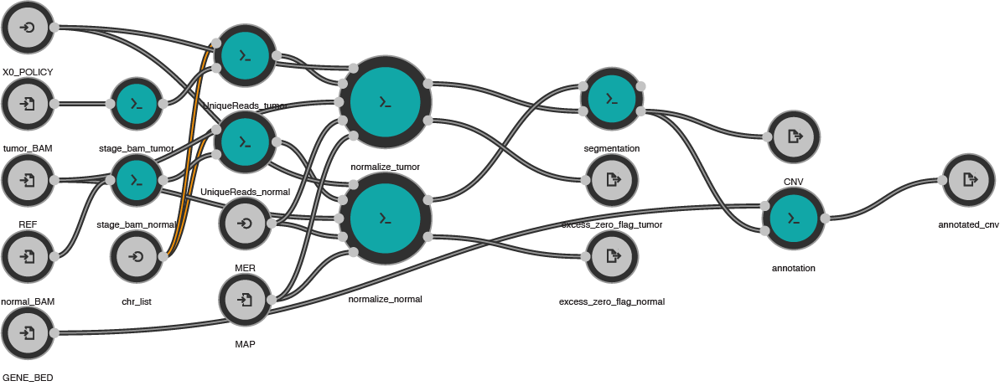

# [BICseq2 CWL pipeline](https://github.com/mwyczalkowski/BICSEQ2.git)

## Algorithm details

The BICSEQ2.CWL project is a workflow implementation of the [BIC-Seq2
software](http://compbio.med.harvard.edu/BIC-seq/). This includes a docker image
containing the software and a CWL workflow implementation.

The following versions of BICSeq tools are used:
  * NBICseq-norm_v0.2.4
  * NBICseq-seg_v0.7.2
  * samtools-0.1.7a_getUnique-0.1.3
  * GEM-binaries-Linux-x86_64-core_i3-20130406-045632

v2.5 data releases for the CPTAC3 consoritium are also associated with specific
reference and database versions.  These and other details can be found in the
[README.processing_description.v2.5.md](README.processing_description.v2.5.md)
file

## Versions

Current version is v2.5.

BICSEQ2.CWL v2.5 retains the same tool and database versions as previous releases, but
implements a new [CWL](https://www.commonwl.org/user_guide/index.html) workflow
to improve reliability and allow large scale deployments.

Current docker image: `mwyczalkowski/bicseq2:20210625`

Prior versions through v2.1 : [https://github.com/ding-lab/BICSEQ2](https://github.com/ding-lab/BICSEQ2)

## Workflow overview

Figure below is a visual representation of the BICSEQ2.CWL workflow, as visualized with [Rabix Composer](http://docs.rabix.io/rabix-composer-home).
Teal circles represent individual CWL tools, and gray circles the inputs and outputs of the workflow.

The principal workflow consists of the following steps:
* Unique reads
  * performs initial processing of BAM file
  * is implemented as a scatter / gather step in CWL, to process all chromosomes in parallel more quickly
* Normalize
  * Run BICseq normalization (`NBICseq-norm.pl`) on all chromosomes
* Segmentation
  * Run BICseq segmentation (`NBICseq-norm.pl`) 
  * Detect CNVs based on the normalized data
* Annotation
  * Obtain gene-level copy number values 
  * Requires gene annotation bed file

Note that [BIC-Seq2](http://compbio.med.harvard.edu/BIC-seq/) can be run in either case-only or case/control mode.
For the purposes of running the Somatic CNV pipeline we utilize the case/control mode, but the case-only mode
is supported as well.

## Inputs

See [script documentation for additional details](https://github.com/mwyczalkowski/BICSEQ2.CWL/tree/master/src).

### Sequence data
Expect WGS data with read length 150.  The BICSeq2 algorithm be run in case-only or case-control mode;
these correspond to different CWL workflows:
* `bicseq2-cwl.case-only.cwl` - tumor BAM only
* `bicseq2-cwl.case-control.cwl` - tumor and normal BAMs required

### REFD
`REFD` is path to reference files, or a compressed file (`.tar.gz`) which contains these.
The reference is split into per-chrom reference files named `CHR.fa`.  

### Mappability files
Mappability files are created by the
[prep_mappability.sh](https://github.com/mwyczalkowski/BICSEQ2.CWL/blob/master/src/prep_mappability.sh)
script.  These files are per chromosome, and named `MER.CHR.txt`, where `MER`
is the base name for mappability files.  Usually,
`MER=${REFNAM}.${READ_LENGTH}mer` (e.g., `GRCh38.d1.vd1.150mer`).

### GENE_BED
Gene annotation bed file, created by [prep_gene_annotation.sh](https://github.com/mwyczalkowski/BICSEQ2.CWL/blob/master/src/prep_gene_annotation.sh) 

## Additional details

### Default parameters
Parameters used by normalization step
* `READ_LENGTH`.  Default 150
* `FRAG_SIZE`.  Default 350
* `BIN_SIZE`.  Default 100

### Staging of files
Copies are made of BAM files in the preliminary "staging" step.  This is done for performance reasons on 
Cromwell so that individual copies of the BAM are not generated for each scatter instance of unique reads step.

### Excess zero testing

"Excess zero" testing is a heuristic error diagnostic.  It identifies situations where column 3 of `NBICseq-norm.pl` output
has 0 as the most frequently observed value, which is associated with spurious results. `X0_policy` determines whether to automatically
check for this situation and what to do when it is identified:
*  `ignore` - do not test
*  `warning` - test for excess zeros.  File `results/excess_zeros/{SAMPLE_NAME}.{CHR}.norm.bin.dist.dat` is written with column 3 counts
      If a "excess zero" situation is detected, file `results/excess_zeros/{SAMPLE_NAME}.{CHR}.norm.bin.excess_zeros_observed.dat` and
      `results/excess_zeros/excess_zeros_observed.dat` is also written.  The latter is a CWL workflow output.
      However, no error is returned and processing continues.  This is the default
*  `error` - same processing as `warning`, but an error is generated and processing stops

